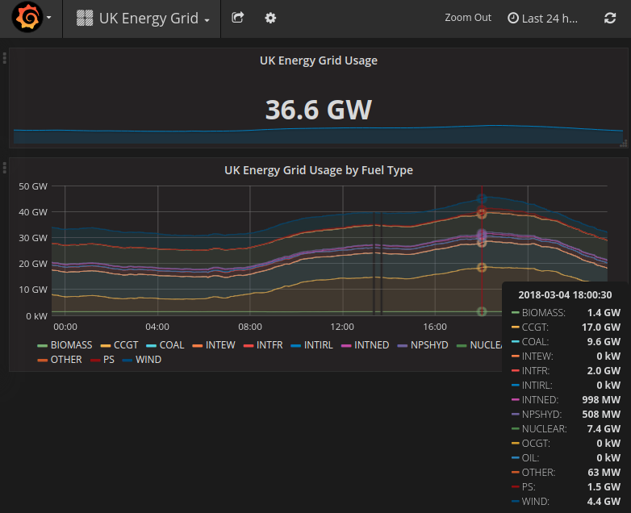
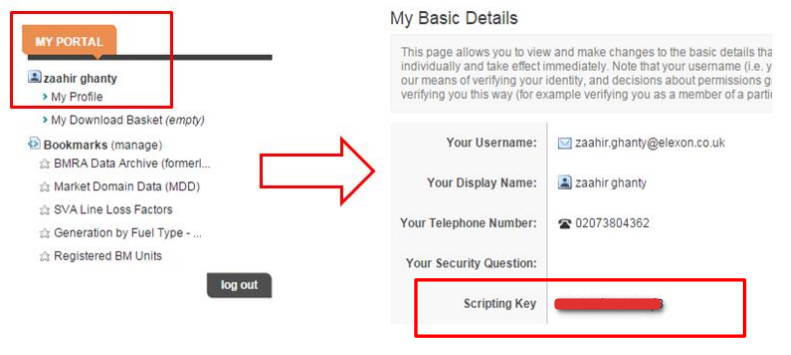

# elexon_exporter

A Prometheus exporter that reads off the United Kingdom energy suppler regulator API

To use this, you need a API key from them for the data access, to do this [register on their](https://www.elexonportal.co.uk/news/latest) site and get a key:

and use `-key` to use it for the exporter.

## It is critical that you set your promethus scrape time to 5 mins
### as you will gain nothing from scraping every 10 seconds and you will upset elexon
